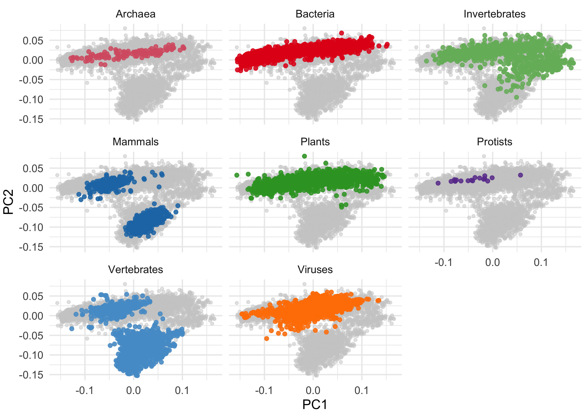

# 1. Introduction

DNA and RNA are composed of codons—triplets of nucleotides that encode specific amino acids or signal the start and stop of protein synthesis. While multiple codons can encode the same amino acid, organisms often prefer certain codons over others—a phenomenon known as codon usage bias. This bias affects protein synthesis efficiency and is shaped by factors such as tRNA availability, GC content, and evolutionary pressures. Codon usage bias plays a key role in gene expression, translation speed, and protein folding. We test the hypothesis that codon and amino acid usage differ significantly across diverse taxa, using Principal Component Analysis (PCA) and linear mixed effects models (LMER) to assess the influence of taxonomy and genomic features like DNA type, and GC and GC3 content.

# 2. Methods

Raw codon frequency data were cleaned to remove non-numeric values and converted into a numeric matrix for PCA, reducing dimensionality and summarizing variance into principal components (PC1 & PC2). Samples were grouped into 9 biological categories based on kingdom taxa and 4 domain taxa (Eukarya, Bacteria, Archaea, Virus). Codon data were then categorised by their corresponding amino acids for a second PCA. 

GC and GC3 content were calculated based on G/C presence in any or third codon position. Linear mixed effects models (LMER) were used to assess the effects of biological group, GC content, GC3 content, and DNA type (fixed effects) on PC1 and PC2 variation, while accounting for potential hierarchical structure by including original kingdom groupings as a random effect. Null hypothesis states that these fixed effects have no impact on codon and amino acid usage variation. Model assumptions were evaluated using residual histograms.

# 3. Results

Codon usage PCA revealed clear separation between biological groups. Vertebrates and mammals clustered tightly, while bacteria and archaea showed compact distributions near the origin. Invertebrates and viruses were more dispersed (Figure 1). Amino acid usage showed similar clustering, with vertebrates and mammals separated strongly along PC1, indicating that codon usage bias carries through to amino acid composition. 

Violin plots of PC1 scores showed that mammals and vertebrates had the highest and most variable scores, suggesting greater within group diversity in amino acid usage (Figure 2). In contrast, bacteria, protists, and archaea exhibited narrower distributions. A negative trend between GC content and PC1 was observed across groups, suggesting higher GC content is associated with lower amino acid usage scores (Figure 3).

LMER results supported the PCA findings. Mammals (p = 0.0127) and vertebrates (p = 0.0176) showed significant differences in amino acid usage. The model explained 52.2% of variation due to fixed predictors, and 59.0% with the addition of group-level variation. Adding GC content, GC3 content, and DNA type improved model fit, with both GC measures highly significant (p < 2 × 10⁻¹⁶). 

The best model, based on the second principal component, explained 55.0% of fixed-effect variation and 79.1% overall. GC content had a strong negative association with PC2, while GC3 had a strong positive effect, indicating distinct roles in shaping amino acid usage. Kingdom as a random effect captured residual taxonomic variation. Together, these findings support the influence of genome composition and evolutionary structure on codon bias, rejecting the null hypothesis. Residuals were approximately normal (Figure 4), supporting model assumptions.

These results demonstrate that codon and amino acid usage patterns are structured by biological group and influenced by genomic GC content and DNA type. Codon bias likely reflects evolutionary selection, contributing to variation across taxa.

